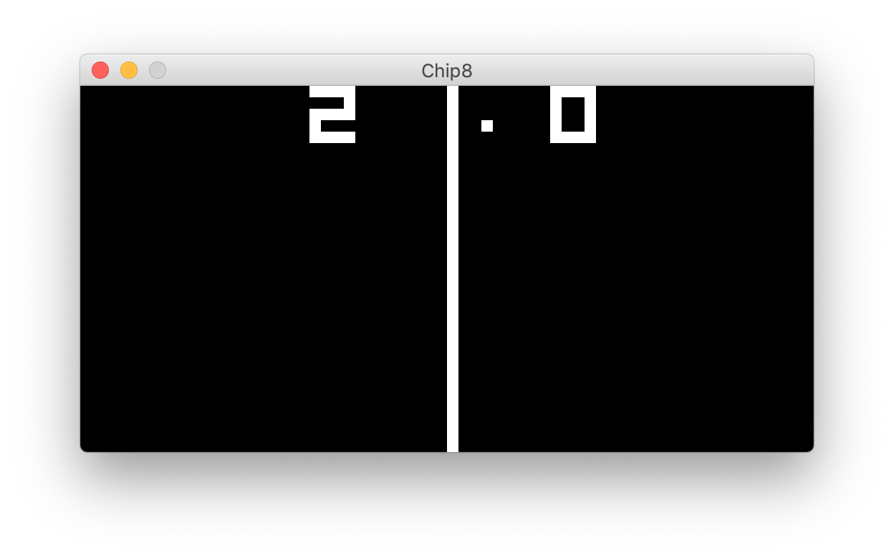

# C8

## The What?

This project is an implementation of Chip8 written in Java. This project was started as an entry point into understanding the fundamentals of emulation.

This emulator supports Chip8 ROMS, however it does not currently support the extended Super Chip8 instructions.

In the current iteration of this emulator The ROM must be present in the source file directory with its name specified in source.

## Building and Running

After cloning this repo copy the desired ROMs into the src directory. Specify the name of the ROM in the Main class constructor.

To build the project, switch to the root directory, and
type:

    gradle build

Then run the program simply using:

    gradle run

### Flags

In its current iteration command line flags must be manually edited in source.

### Keymaping

| Chip 8 Key | Keyboard Key |
| :--------: | :----------: |
| `1`        | `1`          |
| `2`        | `2`          |
| `3`        | `3`          |
| `4`        | `4`          |
| `5`        | `Q`          |
| `6`        | `W`          |
| `7`        | `E`          |
| `8`        | `R`          |
| `9`        | `A`          |
| `0`        | `S`          |
| `A`        | `D`          |
| `B`        | `F`          |
| `C`        | `Z`          |
| `D`        | `X`          |
| `E`        | `C`          |
| `F`        | `V`          |

